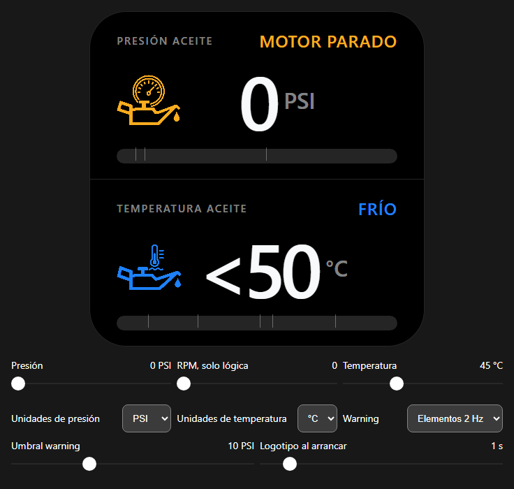

# ESP32-S3 Civic Oil Gauge

[Español](README.es.md) | **English**

Oil-pressure and oil-temperature display for the 480×480 Waveshare
ESP32-S3-Touch-AMOLED-2.16. The project is intended to replace only the visible
Innovate Motorsports MTX-D Oil Pressure/Temperature gauge while retaining the
already-installed sensors and a reversible vehicle harness.

> [!WARNING]
> Oil pressure is still uncalibrated. A1 oil temperature uses only a provisional
> resistor-bench curve; `DEMO` remains the default. Do not use this firmware as
> an engine-protection instrument or remove the MTX-D from the vehicle.

[](https://kytos22.github.io/esp32-s3-civic-oil-gauge/design/references/oil-gauge-design.html)

### [▶ Open the interactive oil-gauge simulator](https://kytos22.github.io/esp32-s3-civic-oil-gauge/design/references/oil-gauge-design.html)

The preview renders continuous smooth-step gauge states at 50 FPS. Adjust oil
pressure, engine RPM and oil temperature with the live sliders. GitHub READMEs
cannot execute JavaScript inline, so both the GIF and this link open the simulator
hosted by GitHub Pages.

## Current status

- Native ESP-IDF 6.0.2 firmware using the official Waveshare BSP 2.0.1 and
  LVGL 9.5.0.
- Hardware-tested 480×480 display and touch initialization.
- Hardware-accepted tear-free FULL rollback path at about 30.5–32.7 physical
  presentations/s on the exact board.
- Unflashed PARTIAL v2 candidate with a 480×32 LVGL draw buffer, three coherent
  full canvases, generation-aware damage recovery and TE-paced presentation.
- Equal 50/50 pressure and temperature regions on a pure-black AMOLED
  background.
- 24 px Spanish semantic states, centered main values, 21-pixel bars and a
  blinking low-pressure warning.
- Thirty-six hardware-independent Unity tests pass, including buffer ownership
  and the provisional 10–140 °C resistor table.
- ADS1115 A1 bench temperature is implemented; direct pressure calibration, the
  reversible Innovate adapter and vehicle validation remain incomplete.

The detailed development position and remaining safety gates are maintained in
[`docs/PROGRESS.md`](docs/PROGRESS.md).

## Features

- Oil pressure in PSI/BAR and oil temperature in °C/°F.
- Explicit cold, warming, optimal, very-hot and warning temperature states.
- Engine-state-gated low-pressure warning; a stopped engine does not trigger a
  false alarm.
- Persistent 1–30 PSI low-pressure warning threshold, shown in PSI or BAR to
  match the selected unit while remaining canonical PSI internally.
- Persistent 110–140 °C high-temperature warning threshold, default 120 °C.
- Persistent 0–10 second Honda/Civic startup splash; zero disables it.
- A non-blocking repeating double-beep loop through the integrated speaker for
  as long as the demo remains in low-pressure warning.
- Demo shows `<50` below its visual floor; sensor mode shows the provisional
  measured value so 10–50 °C resistor points can be checked.
- Warning meaning never relies on colour alone.
- Demo mode remains the build default until measured calibration exists.
- Missing or invalid calibration fails visibly instead of producing engineering
  units.

## Hardware

- Waveshare ESP32-S3-Touch-AMOLED-2.16, 480×480 AMOLED.
- Existing Innovate MTX-D Oil Pressure/Temperature installation.
- 3.3 V ADS1115 at I²C address `0x48`, used for the current A1 bench input.
- Protected automotive 12 V to 5 V supply and reversible harness are required
  before vehicle use.

The board pin map is in [`docs/WAVESHARE_PINOUT.md`](docs/WAVESHARE_PINOUT.md),
the purchase list is in [`docs/BOM.md`](docs/BOM.md), and both proposed signal
routes are described in [`docs/ARCHITECTURE.md`](docs/ARCHITECTURE.md).

## Safety and wiring status

- Never connect vehicle 12 V directly to VBUS, 3V3 or a GPIO.
- Do not assume the Innovate pressure sensor is 0.5–4.5 V or that the
  temperature sensor is a 10 kΩ NTC.
- Do not assign signal functions from wire colours.
- Do not cut the Innovate harness.
- Keep the MTX-D connected for passive reference measurements. Disconnect its
  temperature input before applying the independent 3.3 V/4.99 kΩ A1 pull-up.

The exposed board I²C bus is SDA GPIO15 and SCL GPIO14. It already has 2.2 kΩ
pull-ups to 3.3 V; the planned ADS1115 uses address `0x48`. These facts do not
identify any Innovate sensor wire. Follow the staged procedure in
[`docs/CALIBRATION.md`](docs/CALIBRATION.md) before connecting sensor signals.
The current bench and future sensor paths are also shown in the
[`graphical wiring diagram`](docs/sensor-wiring.html).

## Firmware downloads

There is no production release yet. Validated releases will be stored under
[`firmware/<version>/`](firmware/README.md) with application and complete flash
images, bilingual instructions, visual evidence and SHA-256 checksums.

Development binaries from `build/` are intentionally ignored and must not be
published as releases.

## Build

Use the project wrappers from WSL; they pin the known toolchain and isolate the
PlatformIO test cache from other projects.

Build the complete ESP-IDF firmware:

```bash
./scripts/idf build
```

Run the native measurement and demo tests:

```bash
./scripts/pio test -e native
```

Flashing is a separate hardware operation. Verify the exact target board and
obtain explicit authorization before writing it.

## Repository layout

| Path | Purpose |
| --- | --- |
| `src/` | ESP-IDF entry point, LVGL renderer, fonts and measurement logic |
| `include/` | Public measurement, calibration, pin and demo interfaces |
| `test/` | Native Unity tests |
| `docs/` | Architecture, safety, calibration, design and project evidence |
| `assets/` | Product-owned visual source assets and approved previews |
| `firmware/` | Versioned validated release packages only |
| `scripts/` | Pinned build, test and consistency entry points |

The organization deliberately follows the useful public-project conventions of
the companion Civic boost-gauge repository, but no turbo firmware, sensor data,
settings, diagrams, generated caches or assets are copied into this project.
There is intentionally no “golden version” mechanism; reproducibility comes
from pinned dependencies, tests, documented acceptance evidence and versioned
release hashes.

## Development guide

Contributors and coding agents must read [`AGENTS.md`](AGENTS.md) before changing
the renderer, display timing, calibration gates, pin assignments, release
packaging or hardware procedures. The full maintained documentation map is
[`docs/INDEX.md`](docs/INDEX.md).

The accepted tear-free CO5300 rollback path and the current PARTIAL v2 candidate
are documented in
[`docs/reference/display-pipeline.md`](docs/reference/display-pipeline.md).

## License

Project-authored code, documentation and assets are available under the
[PolyForm Noncommercial License 1.0.0](LICENSE.md). You may study, modify and
redistribute the project and your improvements for permitted noncommercial
purposes. Commercial use is not permitted without separate permission from the
copyright holder. This is source-available software, not OSI open source.

Preserve the required copyright notice in [`NOTICE`](NOTICE). Third-party
dependencies and embedded tools remain under their own licenses.

## Project independence

Honda, Civic, Innovate Motorsports and Waveshare names and marks belong to their
respective owners. This is an independent enthusiast project and is not
affiliated with or endorsed by those companies.
