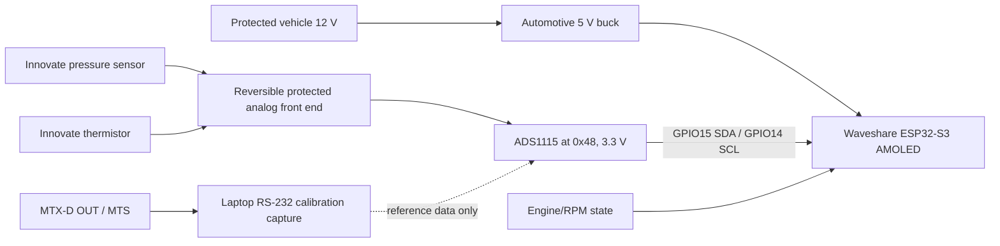

# Technical Plan — Civic ESP32 Oil Gauge

> Adopted project — as-built facts are verified from disk; target items are marked `[A]`.

## Stack

- ESP-IDF 6.0.2 with its C++26 firmware default.
- Official Waveshare ESP32-S3-Touch-AMOLED-2.16 BSP 2.0.1.
- LVGL 9.5.0 with fixed-coordinate custom renderer and embedded fonts.
- Target: ESP32-S3R8, 16 MB flash / 8 MB octal PSRAM.
- Unity native tests through PlatformIO.

The product firmware follows Waveshare's maintained native ESP-IDF path. Conversion
and alarm math remains isolated so it can run natively without hardware.

## Support matrix & budgets

| Target | Declared support | Current evidence |
|---|---|---|
| Waveshare ESP32-S3-Touch-AMOLED-2.16 | 480×480, ESP32-S3R8, 16 MB flash / 8 MB PSRAM | Serialized-font app `701d0b4` flashed and every region verified on the locally recorded exact board; bounded boot proves ESP-IDF 6.0.2, demo mode, 16 MB flash, 8 MB PSRAM, and 480×480 display/touch initialization; corrected physical text appearance pending |
| ADS1115 bench module | 3.3 V, I²C 0x48 | Code and architecture only |
| ADS1115-Q1 final design | AEC-Q100 device on custom protected PCB | Planned, not purchased/finalized |
| Honda Civic Sport 1.5 2017 | switched 12 V automotive environment | Vehicle integration unverified |

Budgets:

- UI refresh: 13 ms application and LVGL cadence; Sprint 1 requires at least 60
  completed physical display FPS, measured by the pinned adapter rather than
  inferred from the scheduler.
- No valid input may exceed 3.3 V at the ADC/ESP32 boundary.
- Calibrated pressure error target: ≤2 PSI in the normal range.
- Calibrated temperature error target: ≤2 °C from 60–130 °C.
- AMOLED current, boot/brownout tolerance, enclosure temperature, and daylight/night brightness remain to be measured.

## Architecture

- Production: direct protected sensors → ADS1115 → conversion/filter/state → display.
- Calibration reference: MTX-D MTS → laptop RS-232 capture; it is not connected
  to the ESP32 gauge.
- No runtime persistence exists; calibration is compile-time and invalid by default.
- CAN/OBD belongs to the separate second display. Only an evidence-backed engine-running/RPM signal may cross into this project.

## Code map

| Path | State | Purpose |
|---|---|---|
| `CMakeLists.txt` / `sdkconfig.defaults` | [E] | Native ESP-IDF project and safe demo/display defaults |
| `src/idf_component.yml` / `dependencies.lock` | [E] | Exact ESP-IDF, Waveshare BSP, LVGL and transitive dependency lock |
| `platformio.ini` | [E] | Native Unity test environment only |
| `partitions.csv` | [E] | 16 MB partition layout |
| `include/board_pins.h` | [E] | Verified Waveshare pins and ADS1115 address |
| `include/calibration_config.h` | [E] | Invalid-by-default calibration and provisional front end |
| `include/gauge_core.h` | [E] | Public conversion, filtering, fault, and alarm types/functions |
| `src/gauge_core.cpp` | [E] | Native-testable measurement math |
| `include/demo_sequence.h` / `src/demo_sequence.cpp` | [E] | Native-testable continuous seven-scene demo interpolation |
| `include/warning_tone_gate.h` / `src/warning_tone_gate.cpp` | [E] | Native-testable one-shot warning-entry gate |
| `src/warning_audio.h` / `src/warning_audio.cpp` | [E] | Non-blocking ES8311/I²S warning-tone worker |
| `src/main.cpp` | [E] | Official BSP display initialization and deterministic demo/calibration gate |
| `src/oil_gauge_ui.cpp` | [E] | Approved fixed 480×480 LVGL renderer |
| `src/fonts/` | [E] | Embedded Montserrat subsets for UI and centered numeric values |
| `test/test_gauge_core/test_main.cpp` | [E] | Fifteen Unity native tests |
| `README.md` | [E] | Project entry point |
| `README.es.md` | [E] | Spanish public entry point linked to the English base |
| `LICENSE.md` / `NOTICE` | [E] | PolyForm Noncommercial 1.0.0 terms and required copyright notice |
| `assets/README.md` | [E] | Oil-owned public visual namespace and provenance rule |
| `assets/oil-gauge-demo.gif` | [E] | Generated looping README preview of synthetic simulator states |
| `firmware/README.md` | [E] | Immutable versioned release-package contract |
| `docs/ARCHITECTURE.md` | [E] | Hardware routes and electrical architecture |
| `docs/ARRIVAL_CHECKLIST.md` | [E] | Board-arrival and pre-vehicle gates |
| `docs/BOM.md` / `docs/bom.csv` | [E] | Purchase plan |
| `docs/CALIBRATION.md` | [E] | Evidence capture and cutover criteria |
| `docs/RESEARCH.md` | [E] | Sourced facts and open measurements |
| `docs/UI_DESIGN.md` | [E] | Approved visual/semantic contract |
| `docs/WAVESHARE_PINOUT.md` | [E] | Verified board pin map |
| `docs/design/references/` | [E] | Editable, standalone, and static approved UI references |
| `docs/.nojekyll` | [E] | Publish the approved standalone simulator unchanged through GitHub Pages |
| `docs/PROGRESS.md` | [E] | Keel living state |
| `docs/decisions.md` | [E] | Append-only decisions |
| `docs/lessons-learned.md` | [E] | Closed problem/solution memory |
| `docs/00-competitive-landscape.md` | [E] | Competitor and roadmap evidence |
| `docs/01-discovery.md` | [E] | Reconstructed discovery |
| `docs/02-functional-spec.md` | [E] | Functional contract and AC identifiers |
| `docs/03-technical-plan.md` | [E] | This as-built plan |
| `docs/flows/` | [E] | Boot/display and calibration/cutover journeys |
| `docs/threat-model.md` | [E] | Honest security/safety posture |
| `docs/api/INDEX.md` | [E] | Measurement-core public surface index |
| `docs/04-adoption-audit.md` | [E] | Prioritized adoption gaps |
| `docs/keel-conformance.md` | [E] | Manifest parity sweep |
| `docs/design/DESIGN-BRIEF.md` | [E] | Adopted exact design brief |
| `docs/design/design-handoff/` | [E] | No-Design adoption bridge and provenance |
| `docs/BUILD-SPEC.md` | [E] | Faithful implementation contract |
| `docs/sprints/` | [E] | Phase 5 sprint tracking |
| `docs/05-test-points.md` | [E] | Acceptance/evidence ledger |
| `docs/REPOSITORY.md` | [E] | Public structure, exclusions and publication gate |
| `docs/sprints/sprint-2-repository-productization.md` | [E] | Repository-productization scope and slices |
| `docs/sprints/sprint-4-noncommercial-license.md` | [E] | Noncommercial licensing scope and verification |
| `scripts/keel-doctor` | [E] | Environment verification and repair plan |
| `scripts/keel-verify` | [E] | Project consistency checks |
| `scripts/keel-handoff-verify` | [E] | Continuation courier verification |
| `scripts/generate-readme-demo-gif.py` | [E] | Reproducible Edge/Pillow renderer for the README GIF |
| `scripts/pio` | [E] | Project-isolated PlatformIO entry point |
| `scripts/idf` | [E] | Pinned ESP-IDF 6.0.2 firmware entry point |
| `docs/playground.md` | [E] | Reproducible software and hardware-tagged exercises |
| `docs/calibration-data/` | [A] calibration sprint | Raw and processed evidence datasets |
| `.claude/skills/keel/` / `.agents/skills/keel/` | [E] | Verified embedded Keel v5.3.2 |
| `CLAUDE.md` / root `AGENTS.md` | [E] | Keel portability lock and project safety rules |
| `include/AGENTS.md`, `src/AGENTS.md`, `test/AGENTS.md` | [E] | Codex path-scoped rules |

## Change map

| Change type | Touch always |
|---|---|
| Sensor conversion/calibration math | `include/gauge_core.h`, `src/gauge_core.cpp`, `include/calibration_config.h`, native tests, `docs/CALIBRATION.md`, AC rows, API index |
| Alarm threshold or engine-state logic | `include/gauge_core.h`, `src/gauge_core.cpp`, `src/main.cpp`, native tests, `docs/UI_DESIGN.md`, functional spec |
| Onboard warning-audio behavior | audio gate + ESP-IDF audio implementation, `src/main.cpp`, Kconfig/defaults, native tests, functional AC row, test ledger, sprint record, decision log, progress card, complete firmware build and separately authorized physical proof |
| Visual state/renderer change | `src/main.cpp`, `src/oil_gauge_ui.cpp`, fonts when applicable, `docs/UI_DESIGN.md`, editable prototype if the binding design changes, new physical capture, affected AC tests |
| Board pin or I²C address | `include/board_pins.h`, `src/main.cpp`, `docs/WAVESHARE_PINOUT.md`, `docs/ARCHITECTURE.md`, arrival checklist |
| Analog front-end value/component | `include/calibration_config.h`, `docs/ARCHITECTURE.md`, `docs/BOM.md`/CSV, calibration evidence and conversion tests |
| Automotive power/harness change | `docs/ARCHITECTURE.md`, BOM/CSV, arrival checklist, threat model; only later product code if diagnostics change |
| Dependency/toolchain change | `src/idf_component.yml`, `dependencies.lock`, `sdkconfig.defaults`, `platformio.ini` when native tests change, `docs/decisions.md`, support matrix, license check, build and native test evidence |
| New fault/public core surface | header + implementation + tests + `docs/api/INDEX.md` and per-surface docs when released |
| Repository/publication change | Root READMEs, `docs/REPOSITORY.md`, firmware/assets namespace, functional AC rows, test ledger, decision log, progress card, privacy scan and `scripts/keel-verify` |
| README simulator/Pages change | Root READMEs, standalone HTML reference, `docs/.nojekyll`, functional AC row, test ledger, playground, sprint record, decision log, progress card and `scripts/keel-verify` |
| Project license change | `LICENSE.md`, `NOTICE`, both root READMEs, technical license status, adoption audit, functional AC row, test ledger, sprint record, decision log, progress card and `scripts/keel-verify` |
| Release/version change | `firmware/<version>/` bilingual instructions, app/full images, visual proof, `SHA256SUMS.txt`, authoritative version touchpoints, clean-tree tests/build/image inspection and applicable hardware evidence; never add a golden snapshot |

## Conventions

- Namespace: `oilgauge`; board/calibration constants live in nested namespaces.
- Constants: `kPascalCase`; types/functions: PascalCase/camelCase as observed.
- Formatting: two-space indentation, braces on the same line, `[[nodiscard]]` on value-returning core APIs.
- Error strategy: explicit `Fault` + `ConvertedValue`; NaN only inside low-level math helpers, never as a displayed value.
- Logging: ESP-IDF logging over USB Serial/JTAG for boot/diagnosis; never log secrets or claim measurements not captured. A runtime debug switch is not yet implemented.
- Comments and identifiers: English going forward. Existing Spanish comment in calibration config is a documentation-language drift to fix when product code is next touched.

## Testing

- Unit tests: Unity through `pio test -e native`.
- Firmware build: `./scripts/idf build`.
- Firmware entry point: `scripts/idf`, pinned to the installed ESP-IDF 6.0.2 environment.
- Native-test entry point: `scripts/pio`; PlatformIO Core 6.1.19 lives in the project
  venv, packages/build outputs live under `/home/marcos/.platformio-oil-gauge`, and
  each command uses an ephemeral no-space source mirror because PlatformIO/SCons
  collapses the two adjacent spaces in this repository path.
- Current Sprint 1 software result: 14/14 native tests pass and a complete
  676,224-byte ESP-IDF 6.0.2 demo image builds with effective 15 ms LVGL refresh,
  one draw unit, and completed-frame FPS statistics. SHA-256 is
  `042942dc254dc1cdb51529c338d716aecedded144edd263097742600b7abb8e5`
  and the embedded application version is `3e0298a`. Exact-board flash and region
  verification pass; eight consecutive completed-frame windows measure 65–67 FPS.
  The current 13 ms app `bf5c932` retains that renderer and adds the accepted audio
  path. A user-supplied 28.423-second 60 FPS physical cycle reviewed on 2026-08-14
  confirms enlarged-label readability, intact glyphs, centered values, and no
  clipping or overlap. The low-opacity warning phase was later rejected as
  dotted-looking; Sprint 1 is reopened for a binary 2 Hz correction and new capture.
- Current Sprint 1 correction result: the AC-06 contract failed first at 0/6, then
  passes 6/6; the deterministic 250 ms boundary regression passes in the 16/16
  native suite. Clean app `002581d` builds as a complete 724,336-byte ESP-IDF 6.0.2
  demo image with SHA-256
  `4443c6c7675e17abc105a316004530963569275e03eaba23f9fa0f2d2287e6e3`.
  Exact-board flash and physical appearance remain `HARDWARE/JUDGMENT`.
- Current Sprint 5 runtime result: exact-board app `bf5c932` uses a 13 ms
  application/LVGL cadence and a CPU1-pinned audio worker. All four flash regions
  verified; the retained bounded log records three completed tone paths and 29
  consecutive completed-frame windows at 66–77 FPS with no panic, watchdog, or
  audio error. Marcos confirmed the physical double beep is audible on 2026-08-11.
- Historical result: README/RESEARCH record a successful full build and eight passing native tests on 2026-07-28.
- Browser prototype driver: Playwright/headless capture is planned but not present.
- Embedded surface driver: serial log plus deterministic demo/calibration fixtures;
  exact-board flash and boot capture are driven; indoor physical appearance passed
  `HARDWARE/JUDGMENT`, while environmental appearance remains open.
- Physical display/power/sensor/MTS/vehicle legs: `HARDWARE`; vehicle leg also `PRODUCTION-RISK`; real assistive/glanceability assessment is `JUDGMENT`.
- Element addressability: compile-time state IDs and deterministic renderer-state names; the HTML prototype sliders need stable IDs if automated.
- Read-back duty: fail on build/test error; capture serial boot log, I²C scan, ADC channels, reset reason, and fault state. Browser console errors must fail prototype checks once the driver exists.
- Accessibility automation: visual contrast computation and captured-state comparison; real daylight/night/color/motion assessment remains guided hardware validation.
- Regression rule: each fixed bug adds a native or renderer-state regression test.
- Debug logging: existing unconditional `Serial` boot diagnostics; a documented on/off switch is `[A]`.

## Environment requirements

| Requirement | Required version/state | Severity | Installation path / consequence |
|---|---|---|---|
| Git | valid repository in the project directory | blocking for Keel commits/handoff verification | Initialized on `main`; local commit identity must be configured before the first commit |
| PlatformIO CLI | 6.1.19 | blocking for build/tests | Project venv at `.venv-platformio`; use `scripts/pio` only |
| Python | version supported by PlatformIO | blocking when installing/running PlatformIO | Use PlatformIO-supported Python; no global install without approval |
| C++ host compiler | C++17, callable by native PlatformIO env | blocking for native tests | PlatformIO toolchain or system compiler |
| ESP-IDF | exactly 6.0.2 | blocking for firmware build | `/home/marcos/esp/v6.0.2/esp-idf`; activate through `scripts/idf` |
| Managed components | exact versions in `src/idf_component.yml` and `dependencies.lock` | blocking for firmware build | Waveshare BSP 2.0.1 and LVGL 9.5.0; network needed only when cache is empty |
| LVGL software renderer | one draw unit while compressed fonts are enabled | blocking for physical text fidelity | `CONFIG_LV_DRAW_SW_DRAW_UNIT_CNT=1`; LVGL 9.5 compressed-font RLE state is shared and must not be decoded concurrently |
| USB data access | board serial/USB visible to selected host | blocking for flash/hardware logs | attach only the locally recorded exact Espressif `303a:1001` device as `/dev/ttyACM0`; the identifier is retained only in ignored local evidence |
| Playwright/browser | current supported version and browser binary | optional until renderer automation sprint | Install only with approval; headless by default |
| Physical instruments | DMM, reference thermometer, back-probes, optional pressure calibrator | blocking for calibration | User-provided hardware; never automated |
| LogWorks + serial adapter | operating on the host connected to MTX-D | blocking for synchronized reference route | Windows external software/hardware |

## Tooling commands

- Environment: `./scripts/keel-doctor --check`.
- Native tests: `./scripts/pio test -e native`.
- Firmware build: `./scripts/idf build`.
- Consistency: `./scripts/keel-verify`.
- Exact-board flash: `./scripts/idf -p /dev/ttyACM0 flash`, only after verifying that
  `/dev/ttyACM0` matches the locally recorded exact Espressif device; authorized
  2026-08-04. The identifier is not part of the publishable tracked snapshot.
- Monitor: `./scripts/idf -p /dev/ttyACM0 monitor`; capture the bounded boot log and
  exit without leaving the port occupied.
- Host static compile: `g++ -std=c++17 -Wall -Wextra -Wpedantic -Iinclude -c src/gauge_core.cpp`.
- No front-end minification pipeline exists; prototypes are source-only HTML.

## Version touchpoints

No project version is declared. A first release must create one source of truth and record every required mirror before any bump.

## License & dependency compatibility

- Project-authored code, documentation and assets: PolyForm Noncommercial 1.0.0;
  commercial use requires separate permission from the copyright holder.
- Dependencies are pinned, but their licenses have not yet been assembled into a distribution decision.
- Third-party dependencies and embedded tools retain their own licenses. Any
  binary release still requires a compatibility review and complete notices before
  packaging.
