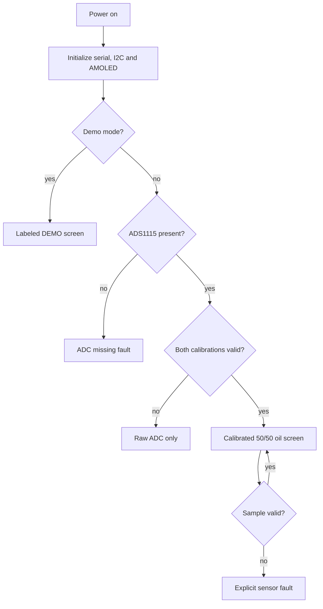

# Flow — Boot and Display

## Trigger

Switched 5 V power reaches the Waveshare board after the protected automotive supply or USB bench supply is connected.

## Steps

1. Firmware starts serial logging and initializes I²C on GPIO15/GPIO14.
2. Firmware scans I²C and reports discovered addresses.
3. Firmware initializes the CO5300 AMOLED.
4. Firmware probes ADS1115 address 0x48.
5. Firmware reads demo-mode and calibration validity.
6. It selects exactly one display mode:
   - demo enabled → labeled simulated screen;
   - demo disabled + ADC present + calibration invalid → raw ADC only;
   - demo disabled + ADC absent → explicit missing-ADC fault;
   - demo disabled + ADC present + validated calibration → calibrated 50/50 oil screen.
7. During operation, each sample is converted with a fault state, filtered, mapped to semantic states, then rendered.
8. Any invalid input replaces the affected measurement with an explicit fault; no last-known value is silently held as current.

## Recovery

- ADC/display initialization is retried only through a controlled reboot until a future recovery policy is specified.
- A missing calibration cannot be bypassed by a UI action.
- Brownout/restart returns to the same gated decision tree.
