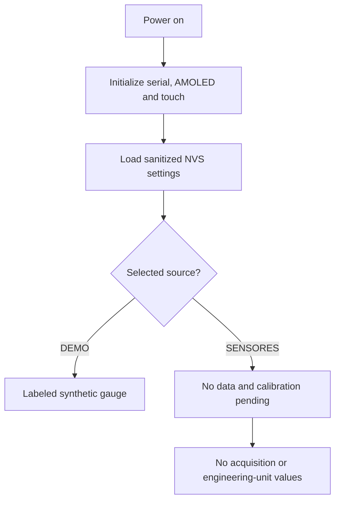

# Flow — Boot and Display

## Trigger

Switched 5 V power reaches the Waveshare board after the protected automotive supply or USB bench supply is connected.

## Steps

1. Firmware starts serial logging and initializes the CO5300 AMOLED and touch input.
2. Firmware loads sanitized preferences from NVS, using compile-time defaults when
   the namespace or an individual key is absent.
3. It selects exactly one current display source:
   - `DEMO` → the labeled synthetic screen;
   - `SENSORES` → `--` and `SIN DATOS`, with no ADS1115 acquisition or conversion.
4. During demo operation, each synthetic sample is mapped to semantic states and
   rendered. The sensor path remains calibration-gated until a later evidence-backed
   slice implements it.
5. Any future invalid real input must replace the affected measurement with an
   explicit fault; no last-known value may be silently held as current.

## Recovery

- Display initialization is retried only through a controlled reboot until a future recovery policy is specified.
- A missing calibration cannot be bypassed by a UI action.
- Brownout/restart returns to the same gated decision tree.
