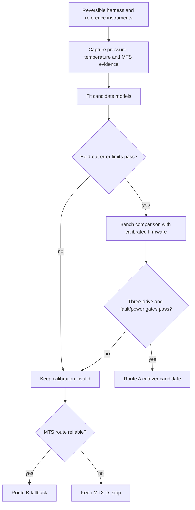

# Flow — Calibration and MTX-D Cutover

## Trigger

The Waveshare board, bench ADC, reversible connectors, measurement tools, and MTX-D reference path are available.

## Steps

1. Photograph the MTX-D, sensors, connectors, keys, labels, and wire colors with power off.
2. Build a reversible high-impedance breakout; do not cut or pierce the harness.
3. Verify ground, excitation, and signal by measurement rather than color.
4. Capture raw pressure A0, excitation A2, MTX-D/LogWorks pressure, and engine/RPM state at the documented operating points.
5. Map the MTX-D thermistor input with a decade box, then compare the installed sensor against a reference thermometer.
6. Capture MTS RX-only frames and identify channel order by synchronized LogWorks comparison.
7. Fit candidate calibration models only when residuals justify them; preserve raw points.
8. Validate on held-out points and reject a model that misses AC-13/AC-14.
9. Enable calibrated firmware only for bench comparison, keeping MTX-D installed.
10. Repeat cold/hot/multiple-speed tests over at least three supervised drives.
11. Confirm fault behavior, startup/brownout behavior, power, enclosure temperature, and visibility.
12. Decide:
    - Route A passes → prepare final protected PCB/harness and cutover;
    - Route A inconclusive → retain Route B/MTX-D conditioning;
    - either route fails safety gates → keep MTX-D visible and stop.

## Failure and recovery

- A disputed pin, nonlinear curve, missing RPM state, unstable supply, or unexplained frame keeps the affected route disabled.
- The recovery state is always the intact MTX-D and original harness.
